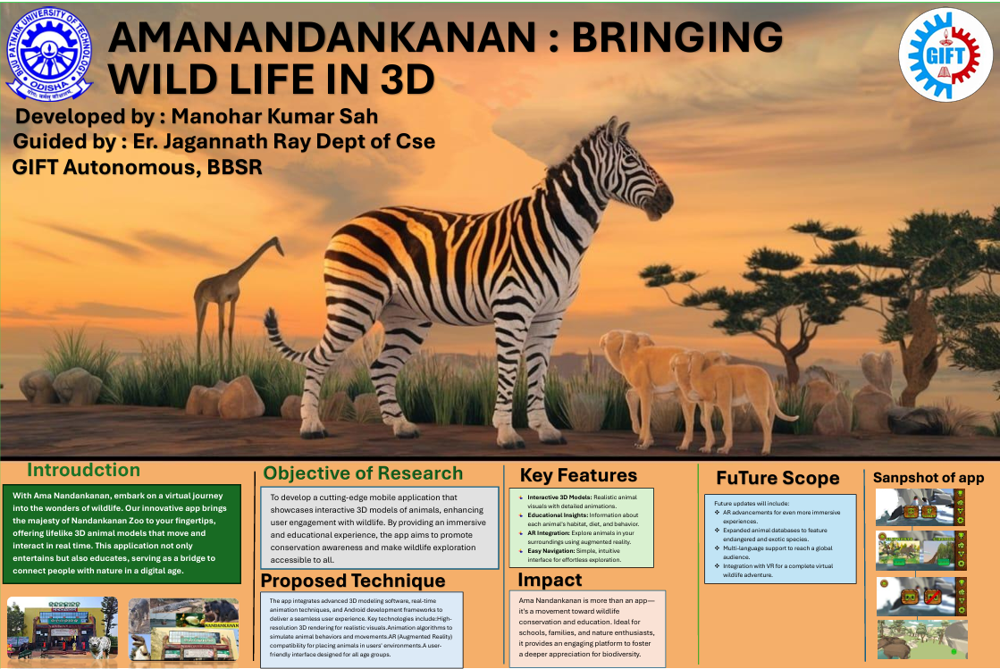

# 🐾 AmaNandankanan Zoo App

**AmaNandankanan** is a fictional zoo app that provides a fun and interactive way to explore animals. The app includes animal listings, detailed views, zoo information, and even VR-like experiences.

---

## 📱 Overview

This Android application allows users to:
- Browse a list of animals with images.
- View detailed information about each animal.
- Access zoo contact information.
- Experience an interactive dialog warning for a special animal.

---

## 🚀 Features & Activities

### 🦁 Animal Listing Activity
- Displays at least 5 animals.
- Each row includes:
  - 🖼️ Thumbnail image of the animal.
  - 📝 Name of the animal.
- Clicking a row opens the **Animal Detail Activity**.

### 🐘 Animal Detail Activity
- Reused for all animals.
- Displays:
  - 🏷️ Animal name.
  - 📸 Large image of the animal.
  - 📖 Short description.

### 🏞️ Zoo Information Activity
- Shows:
  - 🏛️ Zoo name.
  - ☎️ Clickable phone number (888-8888) that opens the dialer.
- Triggered from the **Information** option in the menu.

---

## 🧭 Menu Items (Overflow Menu)
- 📘 **Information** → Opens zoo info activity.
- ❌ **Uninstall** → Launches an intent to uninstall the app.

---

## ⚠️ Dialog Box Feature
- When clicking on the **last animal** in the list:
  - A warning alert pops up (e.g., “This animal is very scary! Proceed?”).
  - **Yes** → Proceeds to detail view.
  - **No** → Stays on the same screen.

---

## 📸 Screenshots

## 💻 Technologies Used
  - Java (Android)
  - Android Studio
  - XML Layouts
  - ListViews & Custom Adapters
  - Dialogs, Menus, Intents
  - VR/AR support ideas (for future extension)

## 👨‍💻 Author
- Manohar Kumar

A fictional VR-powered zoo experience built with Android. Designed to explore animal behavior and provide an engaging and interactive user interface through classic Android components.
